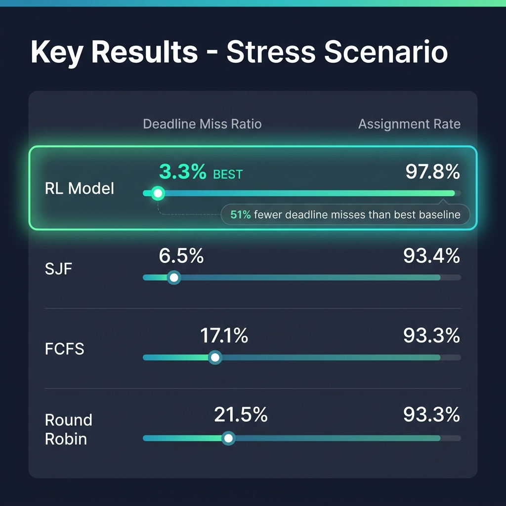
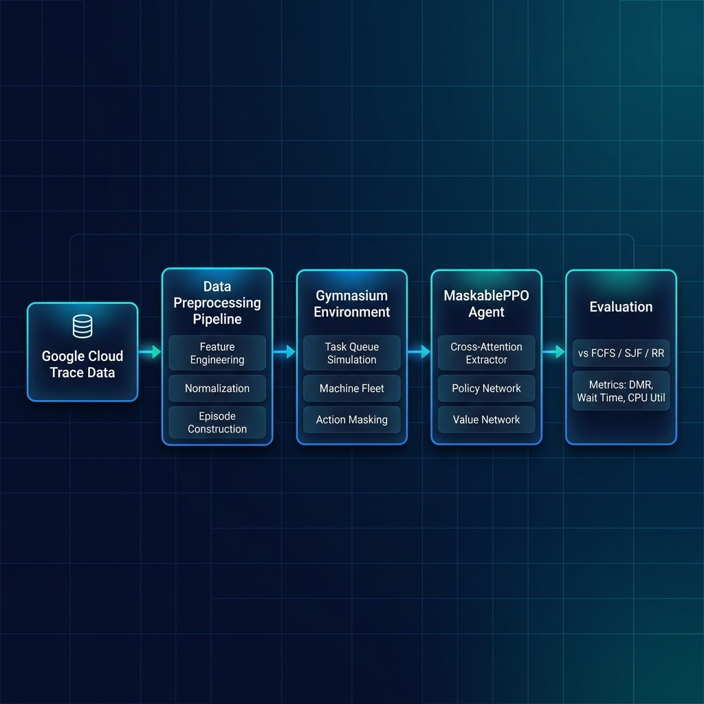

<div align="center">

# 🧠 AI-Based Deadline-Aware OS Scheduler

**A reinforcement learning approach to cloud task scheduling using MaskablePPO with cross-attention feature extraction**

[](https://python.org)
[](LICENSE)
[](https://github.com/Arnav-Nehra28/AI-Based-Deadline-Aware-OS-Scheduler/actions)
[](https://stable-baselines3.readthedocs.io/)
[](https://gymnasium.farama.org/)

</div>

---

## ✨ Key Results

<div align="center">

| Metric | RL Model | SJF | FCFS | Round Robin |
|:---|:---:|:---:|:---:|:---:|
| **Deadline Miss Ratio** | **3.3%** ✅ | 6.5% | 17.1% | 21.5% |
| **Assignment Rate** | **97.8%** ✅ | 93.4% | 93.3% | 93.3% |
| **Mean Waiting Time** | 0.53 | 5.51 | 15.81 | 9.84 |

*Stress scenario — 1,920 tasks, constrained machine fleet*

</div>

> **The RL agent achieves 51% fewer deadline misses than the best heuristic baseline (SJF), while scheduling 4.3% more tasks under extreme resource contention.**

<div align="center">
  
</div>

---

## 🏗️ Architecture

The system treats task scheduling as a **sequential decision problem** where an RL agent learns to assign incoming cloud tasks to machines in real time.

<div align="center">
  
</div>

```
Google Cloud Trace → Preprocessing → Gym Environment → MaskablePPO Agent → Evaluation
                                           ↕                    ↕
                                    Action Masking      Cross-Attention
                                    Machine Fleet       Policy + Value Networks
```

### RL Formulation

| Component | Description |
|:---|:---|
| **State** | Task demand, queue pressure, machine capacities, running jobs, deadline urgency, fleet utilization |
| **Action** | Select one of top-*k* candidate machines or defer the scheduling decision |
| **Reward** | Composite signal: feasibility bonus, wait penalty, balance/fragmentation scores, deadline tracking |
| **Policy** | `MaskablePPO` with a custom **cross-attention feature extractor** that attends over candidate machines |

---

## 🔬 Technical Highlights

- **Custom Gymnasium Environment** — Full online scheduling simulator with dynamic task arrivals, job completion events, and capacity tracking across a multi-machine fleet
- **Cross-Attention Feature Extractor** — Task embedding queries over machine candidate embeddings via `nn.MultiheadAttention`, enabling the policy to reason about task–machine fit
- **Action Masking** — Invalid/infeasible machine assignments are masked before the policy samples, ensuring 100% valid actions during inference
- **Multi-component Reward Shaping** — 15+ shaped reward terms including deadline tracking, utilization bonuses, fragmentation penalties, and stall recovery
- **Curriculum & PBT Training** — Support for curriculum learning (easy → hard scenarios) and population-based hyperparameter search
- **Fair Evaluation Pipeline** — Deterministic train/val/test episode splits with reproducible FCFS, SJF, and RR baselines on identical workloads

---

## 🛠️ Tech Stack

| Category | Technologies |
|:---|:---|
| **RL Framework** | [Stable-Baselines3](https://stable-baselines3.readthedocs.io/) + [SB3-Contrib](https://sb3-contrib.readthedocs.io/) (MaskablePPO) |
| **Environment** | [Gymnasium](https://gymnasium.farama.org/) (custom `TaskSchedulingEnv`) |
| **Deep Learning** | [PyTorch](https://pytorch.org/) (cross-attention extractor, policy/value networks) |
| **Data** | NumPy, Pandas, scikit-learn |
| **Visualization** | Matplotlib, Seaborn |
| **CI/CD** | GitHub Actions |
| **Dataset** | [Google Cloud Cluster Trace](https://github.com/google/cluster-data) |

---

## 📁 Repository Structure

```text
.
├── data_preprocessing/        # Raw trace → processed dataset pipeline
│   ├── download_raw_datasets.py
│   ├── build_rl_env_dataset.py
│   ├── pipeline_config.py
│   └── ...                    # 12 preprocessing stages
├── rl_pipeline/               # Core scheduling environment
│   ├── environment.py         # TaskSchedulingEnv (1,090 lines)
│   ├── env_dataset.py         # Dataset loader
│   └── gym_compat.py          # Gymnasium compatibility layer
├── training/rl/               # Training & evaluation
│   ├── train_ppo.py           # Main MaskablePPO training
│   ├── train_curriculum.py    # Curriculum learning
│   ├── train_pbt.py           # Population-based training
│   ├── attention_extractor.py # Cross-attention feature extractor
│   ├── evaluate_model.py      # FCFS/SJF/RR comparison
│   ├── evaluation_core.py     # Metrics engine
│   └── ...                    # Validation, testing, reporting
├── tests/                     # Environment & evaluation tests
├── docs/                      # Documentation assets
├── requirements.txt
├── LICENSE
└── CITATION.cff
```

---

## 🚀 Quick Start

### Prerequisites

```bash
python3 -m venv venv
source venv/bin/activate
pip install --upgrade pip
pip install -r requirements.txt
```

For GPU training (recommended):
```bash
pip install torch --index-url https://download.pytorch.org/whl/cu128
```

### 1. Build the Preprocessing Outputs

```bash
python -m data_preprocessing
```

### 2. Train the RL Scheduler

```bash
python -m training.rl.train_model \
  --run-name my_scheduler_run \
  --device cuda \
  --total-timesteps 200000
```

### 3. Evaluate Against Baselines

```bash
python -m training.rl.evaluate_model \
  --run-dir artifacts/rl/my_scheduler_run \
  --device cuda
```

### 4. Generate Performance Report

```bash
python -m training.rl.generate_performance_metrics_file \
  --run-dir artifacts/rl/my_scheduler_run
```

> 📖 For advanced training options (curriculum learning, PBT, attention config), see [`training/rl/README.md`](training/rl/README.md)

---

## 📊 Evaluation Metrics

| Metric | Formula | What It Measures |
|:---|:---|:---|
| **Deadline Miss Ratio** | `missed / total` | SLA compliance under load |
| **Mean Waiting Time** | `start - arrival` | Queue responsiveness |
| **Turnaround Time** | `completion - arrival` | End-to-end task latency |
| **CPU Utilization** | `busy_time / total_time` | Resource efficiency |
| **Assignment Rate** | `scheduled / total` | Throughput under contention |

### Detailed Results

<details>
<summary><b>📋 Full Comparison Tables (click to expand)</b></summary>

#### Stress Scenario
| Scheduler | DMR | Wait Time | Turnaround | CPU Util | Assignment Rate |
|:---|:---:|:---:|:---:|:---:|:---:|
| **RL Model** | **0.033** | 16.07 | 181.03 | 0.137 | **0.978** |
| SJF | 0.066 | 5.57 | 22.83 | 0.239 | 0.935 |
| FCFS | 0.171 | 5.93 | 23.47 | 0.161 | 0.934 |
| RR | 0.215 | 6.68 | 24.23 | 0.159 | 0.934 |

#### Medium Scenario
| Scheduler | DMR | Wait Time | Turnaround | CPU Util | Assignment Rate |
|:---|:---:|:---:|:---:|:---:|:---:|
| **RL Model** | **0.005** | **0.53** | **163.52** | **0.023** | **1.000** |
| SJF | 0.005 | 5.51 | 168.50 | 0.023 | 1.000 |
| FCFS | 0.010 | 15.81 | 178.80 | 0.022 | 1.000 |
| RR | 0.010 | 9.84 | 172.83 | 0.022 | 1.000 |

</details>

---

## 📚 Documentation

| Document | Description |
|:---|:---|
| [`training/rl/README.md`](training/rl/README.md) | RL formulation, training commands, hyperparameter guide |
| [`data_preprocessing/README.md`](data_preprocessing/README.md) | Dataset pipeline, schema, and validation |
| [`walkthrough.md`](walkthrough.md) | Detailed performance analysis with visualizations |

---

## 👥 Authors

- **Arnav Nehra**
- **Rahul Thakur**
- **Uday Thakur**

---

## 📄 License

This project is released under the [MIT License](LICENSE).

If you use this work, please cite it:

```bibtex
@software{nehra2025scheduler,
  title     = {AI-Based Deadline-Aware OS Scheduler},
  author    = {Nehra, Arnav and Thakur, Rahul and Thakur, Uday},
  year      = {2025},
  url       = {https://github.com/Arnav-Nehra28/AI-Based-Deadline-Aware-OS-Scheduler},
  license   = {MIT}
}
```
